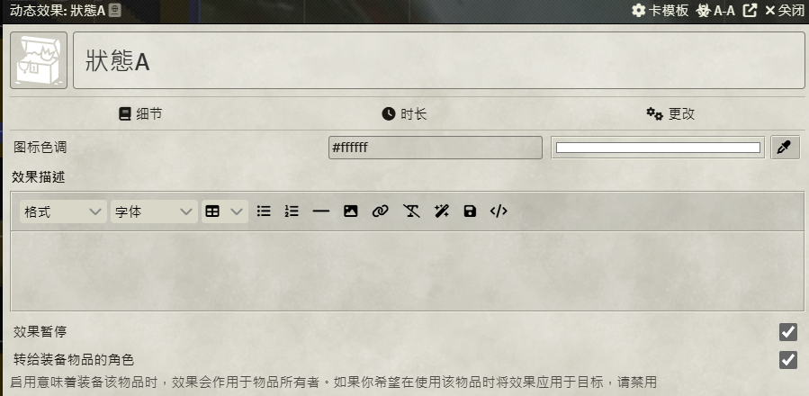

English | [繁體中文](README_TCH.md)

# FoundryVTT Item Transform Macro Tutorial

## Example

### Scriptable Items

### Dynamic Active Effects

## Module-Optional

* [Scriptable Items](https://foundryvtt.com/packages/scriptable-items)
* [Dynamic Active Effects](https://foundryvtt.com/packages/dae)

## Base Script

> If you don't want to use module to do it

### add item to actor

```js
// get a actor called test
let test =game.actors.getName("test");
// get item id called XD3kQ0JxvPDamH2m
let testitem=game.items.get("XD3kQ0JxvPDamH2m");
// add item to actor
test.createEmbeddedDocuments("Item", [testitem.toObject()])
```

### delete item from actor

```js
// get item in actor
let item;
// using delete function to removed item from actor
item.delete();
```

### get item from compendium
```js
// id format: Compendium.dnd5e_classpack.itempack.Item.A8FA9E9D797EC9FB
// removed Compendium
// dnd5e_classpack.itempack is pack id
// A8FA9E9D797EC9FB is item id

// first get pack
let testPack = game.packs.get("dnd5e_classpack.itempack");
// then use id to find item
let testItem = await testPack.getDocument("A8FA9E9D797EC9FB");
```

## With module-Scriptable Items
### Reference
[scriptable Items Instruction](https://github.com/FurtherV/scriptable-items)
### How to setup

* Create item
* Click "scriptable item" button on top
  * 
* It will open a edit page
  * 
* add triggers with button
  * 
* add script
  * 

### Script

```js
// get actor
let cActor = actor;
// item you wanna transform
let giveItem=game.items.get("B1QGodNijs2Ro5Ie");
// add item to actor
cActor.createEmbeddedDocuments("Item", [giveItem.toObject()])
// delete chat room button message generated from this script
optional.message.delete();
// remove original item
item.delete();
```

## With module-Dynamic Active Effects
### Reference
[Dynamic Active Effects Instruction](https://gitlab.com/tposney/dae)
### How to setup

* Create item
  * 
* Click "active effect" button on top
  * 
* setting effect pause and transfer effect to actor, and your effect name
  * Especially effect name as my script is based on effect name
  * 
* setting effect attribute to ```macro.itemMacro```
  * 
* add script
  * back to item page click "DIME" button on top
  * 

### Script

```js
// when effect turn on it trigger
if(args[0]=="on"){
// get last args-> last args contains multiple args we need
let cArgs = args[args.length-1];
// get actor equipped or held item
let cActor = fromUuidSync(cArgs.actorUuid);
// get item triggered effect
let cItem = cArgs.item;
// get effect name
let cEfName = cArgs.efData.name;

let giveItemId = "";
// if effect name called "A"
// then item will be transform into itemA
if(cEfName==="A"){
// get itemA id and replace it
giveItemId="itemAid";
}

if(cEfName==="B"){
giveItemId="itemBid";
}

// if get right effect name then give player item and delete triggered item
if(giveItemId!==""){
// get transfromed item
let giveItem=game.items.get(giveItemId);
// add item to actor
cActor.createEmbeddedDocuments("Item", [giveItem.toObject()])
// removed original item
cItem .delete();
}
}
```
