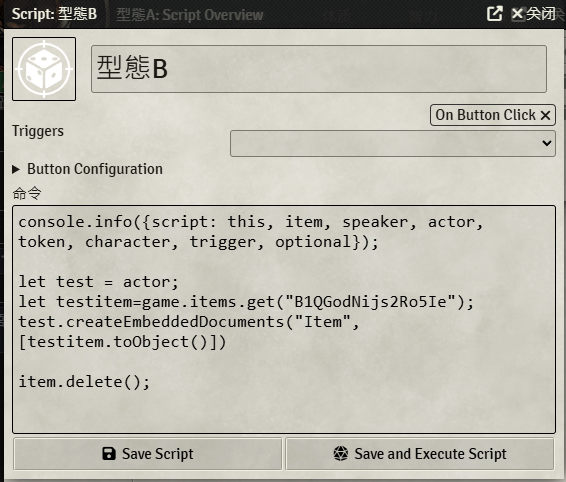

English | [繁體中文](README_TCH.md)

# FoundryVTT Item Transform Macro Tutorial

## Example


## Module-Optional

* [Scriptable Items](https://foundryvtt.com/packages/scriptable-items)
* [Dynamic Active Effects](https://foundryvtt.com/packages/dae)

## Base Script

> If you don't want to use module to do it

### add item to actor

```js
// get a actor called test
let test =game.actors.getName("test");
// get item id called XD3kQ0JxvPDamH2m
let testitem=game.items.get("XD3kQ0JxvPDamH2m");
// add item to actor
test.createEmbeddedDocuments("Item", [testitem.toObject()])
```

### delete item from actor

```js
// get item in actor
let item;
// using delete function to removed item from actor
item.delete();
```

### get item from compendium
```js
// id format: Compendium.dnd5e_classpack.itempack.Item.A8FA9E9D797EC9FB
// removed Compendium
// dnd5e_classpack.itempack is pack id
// A8FA9E9D797EC9FB is item id

// first get pack
let testPack = game.packs.get("dnd5e_classpack.itempack");
// then use id to find item
let testItem = await testPack.getDocument("A8FA9E9D797EC9FB");
```

## With module
### How to setup

* Create item
* Click "scriptable item" button on top
  * 
* It will open a edit page
  * 
* add triggers with button
  * 
* add script
  * 

### Script

```js
// get actor
let test = actor;
// item you wanna transform
let testitem=game.items.get("B1QGodNijs2Ro5Ie");
// add item to actor
test.createEmbeddedDocuments("Item", [testitem.toObject()])
// delete chat room button message generated from this script
optional.message.delete();
// remove original item
item.delete();
```

