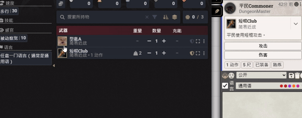
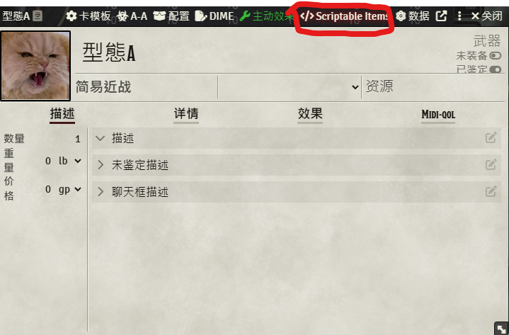
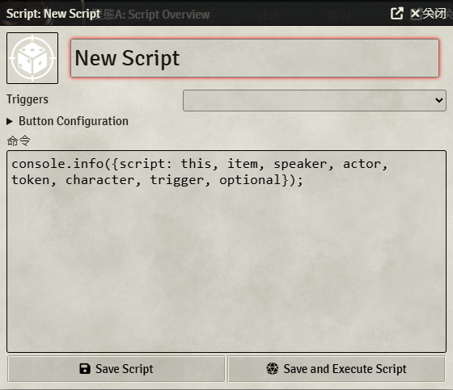
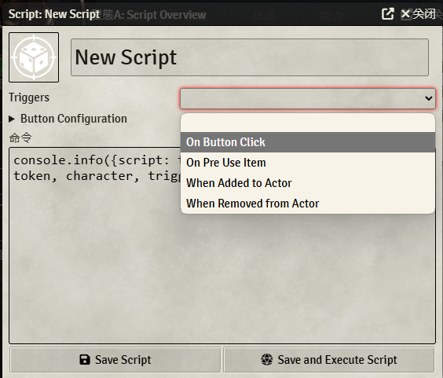
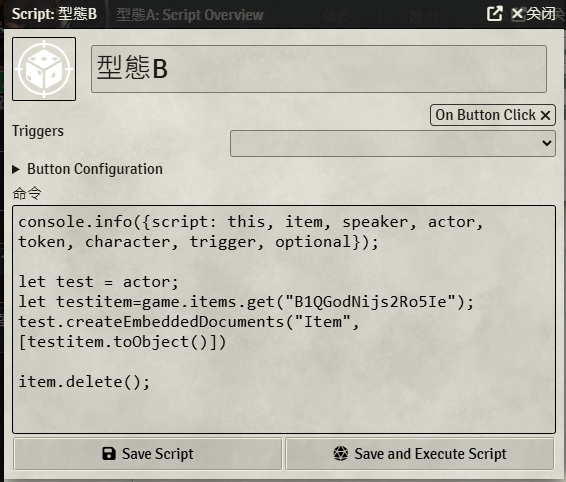
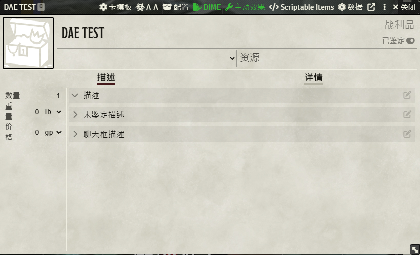
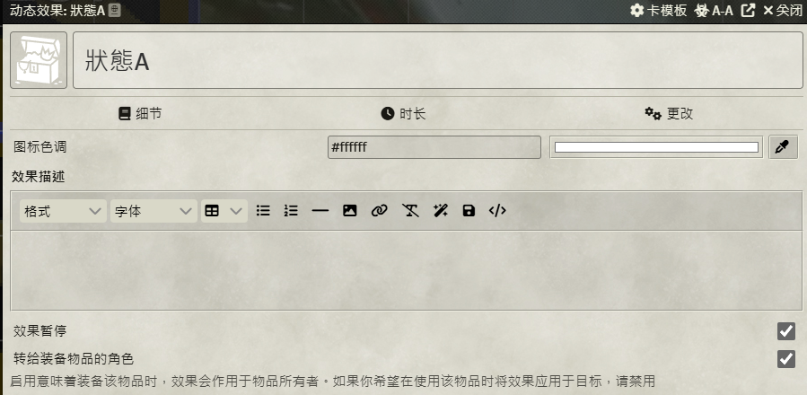
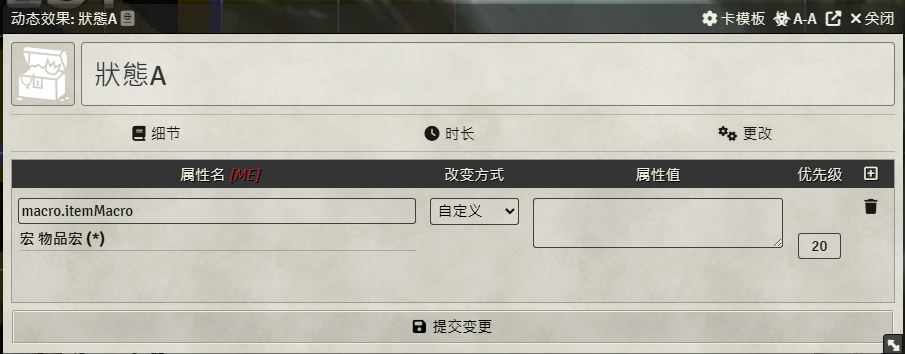
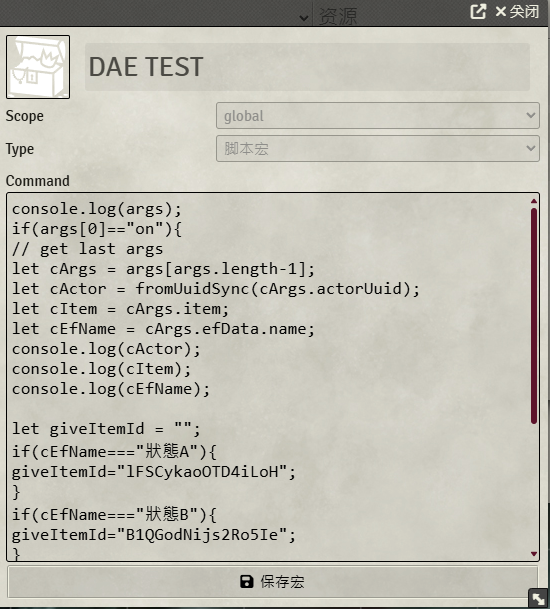

English | [繁體中文](README_TCH.md)

# FoundryVTT 物品轉換腳本

## 範例



## 可選安裝插件

* [Scriptable Items](https://foundryvtt.com/packages/scriptable-items)
* [Dynamic Active Effects](https://foundryvtt.com/packages/dae)

## 基礎腳本

> 如果你不想安裝額外的插件

### 新增物品到角色

```js
// 取得叫做 test 的角色
let test =game.actors.getName("test");
// 取得 id 為 XD3kQ0JxvPDamH2m 的物品
let testitem=game.items.get("XD3kQ0JxvPDamH2m");
// 新增此物品到角色
test.createEmbeddedDocuments("Item", [testitem.toObject()])
```

### 將特定物品從角色移除

```js
// 請自行寫取得特定物品的方法，在此省略
let item;
// 直接使用 delete() 方法來從角色身上刪除道具
item.delete();
```

### 從合集包取得物品
```js
// id 格式: Compendium.dnd5e_classpack.itempack.Item.A8FA9E9D797EC9FB
// 去除 Compendium 前綴
// dnd5e_classpack.itempack 是合集包id
// A8FA9E9D797EC9FB 是物品 id

// 首先透過合集包id取得合集包
let testPack = game.packs.get("dnd5e_classpack.itempack");
// 然後透過物品id取得物品
let testItem = await testPack.getDocument("A8FA9E9D797EC9FB");
```

## 使用插件-Scriptable Items
### 參考資料
[scriptable Items 說明](https://github.com/FurtherV/scriptable-items)
### 怎麼設定？

* 創建物品
* 點物品上方的 "scriptable item" 按鈕
  * 
* 開啟編輯頁面
  * 
* 新增觸發方式
  * 
* 新增腳本
  * 

### 腳本

```js
// 取得角色
let cActor = actor;
// 取得你想轉換成的物品id的物品
let giveItem=game.items.get("B1QGodNijs2Ro5Ie");
// 新增物品到角色
cActor.createEmbeddedDocuments("Item", [giveItem.toObject()])
// 刪除聊天室的按鈕訊息
optional.message.delete();
// 移除原本的物品
item.delete();
```

## 使用插件-Dynamic Active Effects
### 參考資料
[Dynamic Active Effects 說明](https://gitlab.com/tposney/dae)
### 如何設定

* 創建道具
  * 
* 點擊道具上方的 "主動效果" 按鈕
  * 
* 設定暫停效果和轉移效果給裝備角色，還有記得改好效果名稱
  * 效果名稱很重要，腳本會基於效果名稱來設定
  * 
* 設定效果屬性為 ```macro.itemMacro```
  * 
* 新增腳本
  * 在物品頁面點擊上方的 "DIME" 按鈕
  * 

### Script

```js
// 當效果開啟才觸發
if(args[0]=="on"){
// 取得最後的參數-> 最後的參數有我們需要的許多參數
let cArgs = args[args.length-1];
// 取得裝備或持有此道具的角色
let cActor = fromUuidSync(cArgs.actorUuid);
// 取得觸發效果的物品
let cItem = cArgs.item;
// 取得效果名稱
let cEfName = cArgs.efData.name;

let giveItemId = "";
// 下面的狀態中，如果狀態叫做 "A"
// 則物品會被轉換為 道具A
if(cEfName==="A"){
// 取得你要的物品ID替換掉"道具Aid"
giveItemId="道具Aid";
}

if(cEfName==="B"){
giveItemId="itemBid";
}

// 如果有正確觸發效果，則會給角色轉換後的道具，並刪除原本的道具
if(giveItemId!==""){
// 取得轉換後道具
let giveItem=game.items.get(giveItemId);
// 將道具給角色
cActor.createEmbeddedDocuments("Item", [giveItem.toObject()])
// 去除原本道具
cItem .delete();
}
}
```
